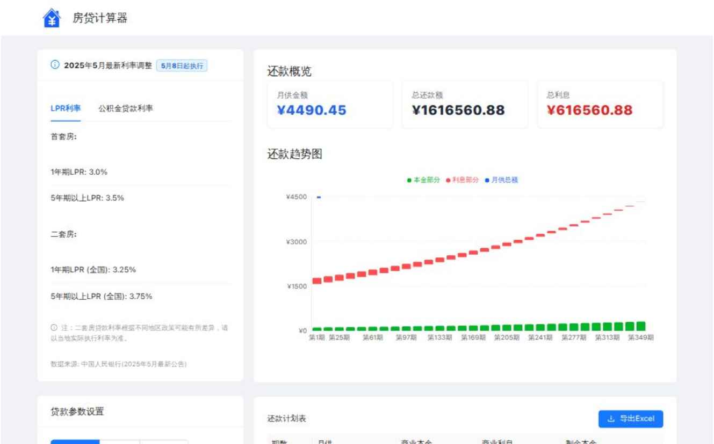
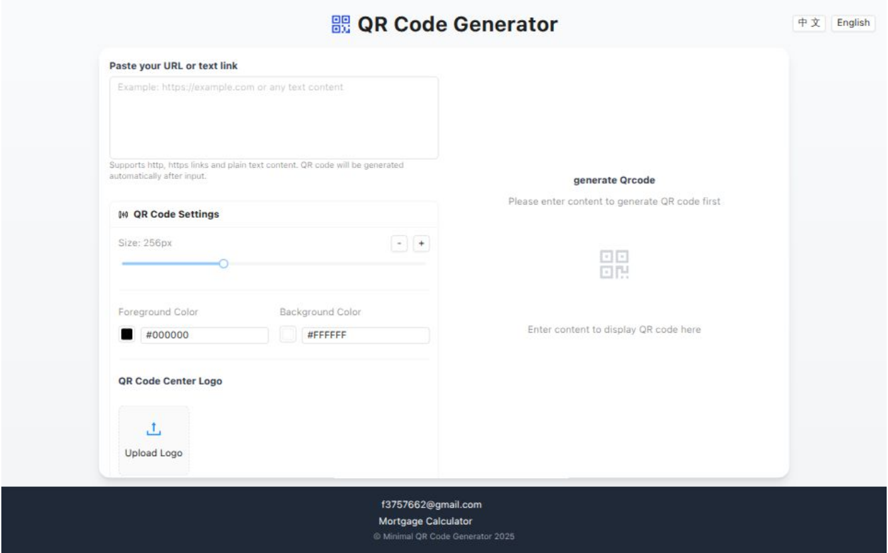
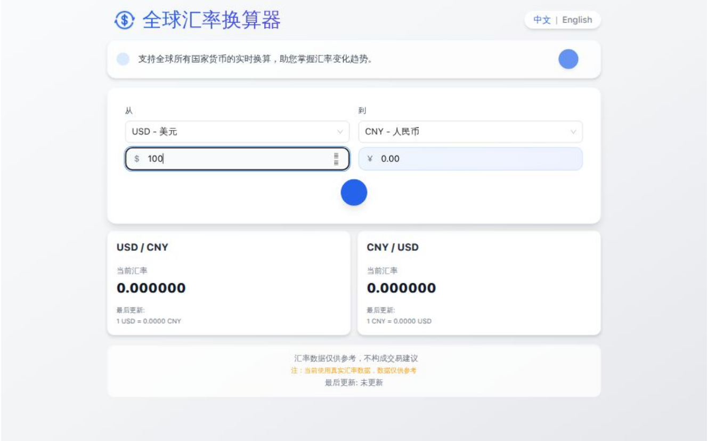
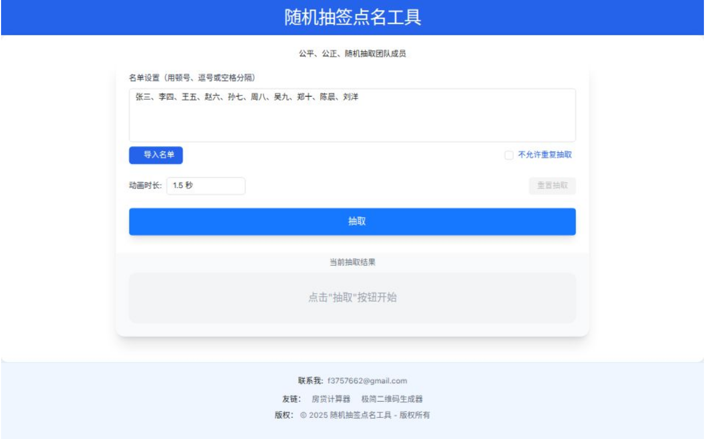

**English** | [中文](./README.zh.md)

# Web-Tools Hub
>Tools List
## Latest 2025 Mortgage Calculator
>The most up-to-date mortgage calculator for May 2025, supporting commercial loans,公积金 loans, and combined loan calculations. Provides a comparison between equal principal & interest and equal principal repayment methods, with real-time calculations of monthly payments, total interest, and repayment schedules.

  + 

## Minimalist QR Code Generator
>A free, simple QR code generator that allows you to add logo images, customize QR code size and color.
  + 

## Global Currency Converter
>Real-time conversion of all global currencies, helping you stay informed about exchange rate trends.
    + 

## Random Draw & Name Picker Tool
>A fair and impartial random draw and name picker tool designed to help teams quickly select members at random. Supports list import and draw settings, with a simple and efficient operation.

    + 

